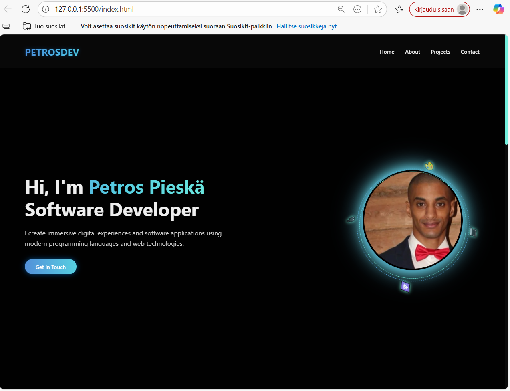
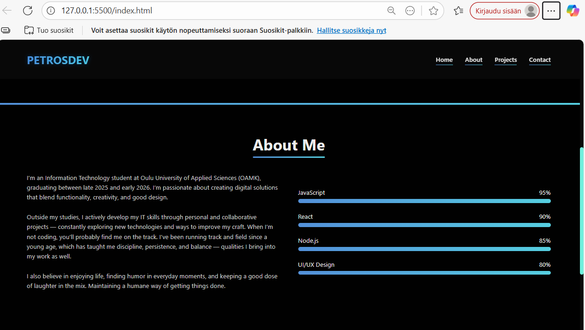
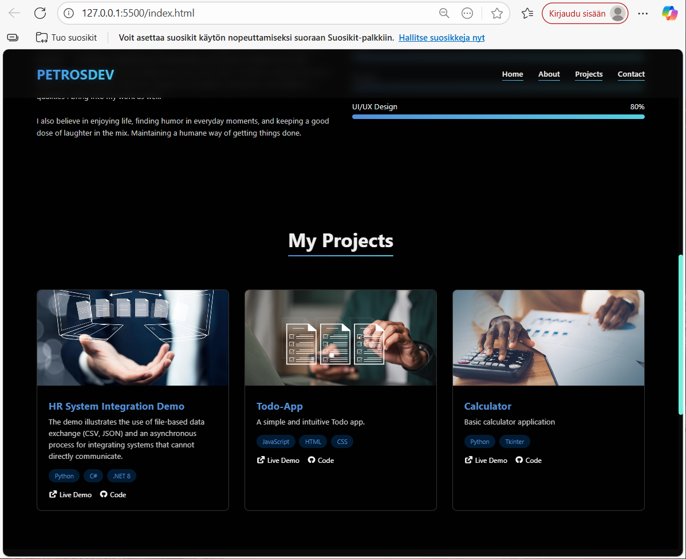
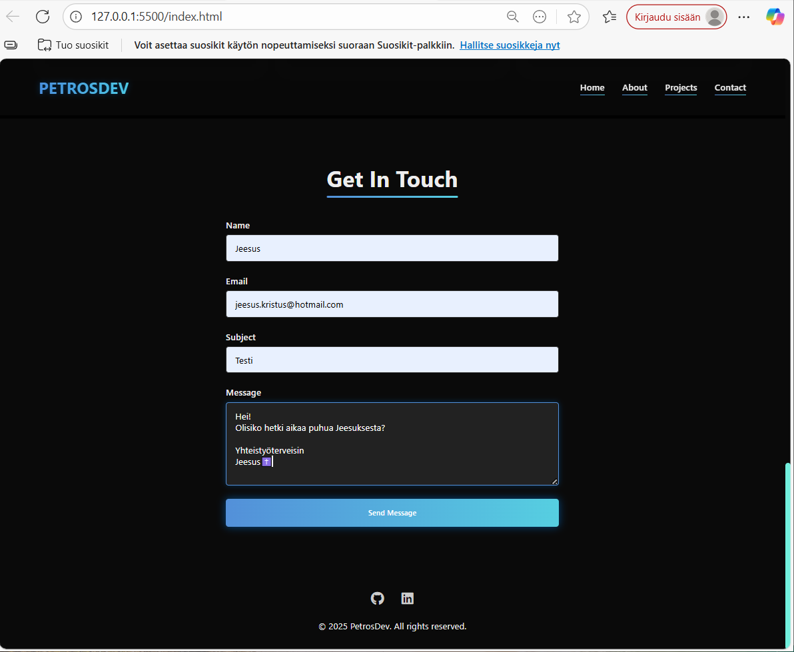
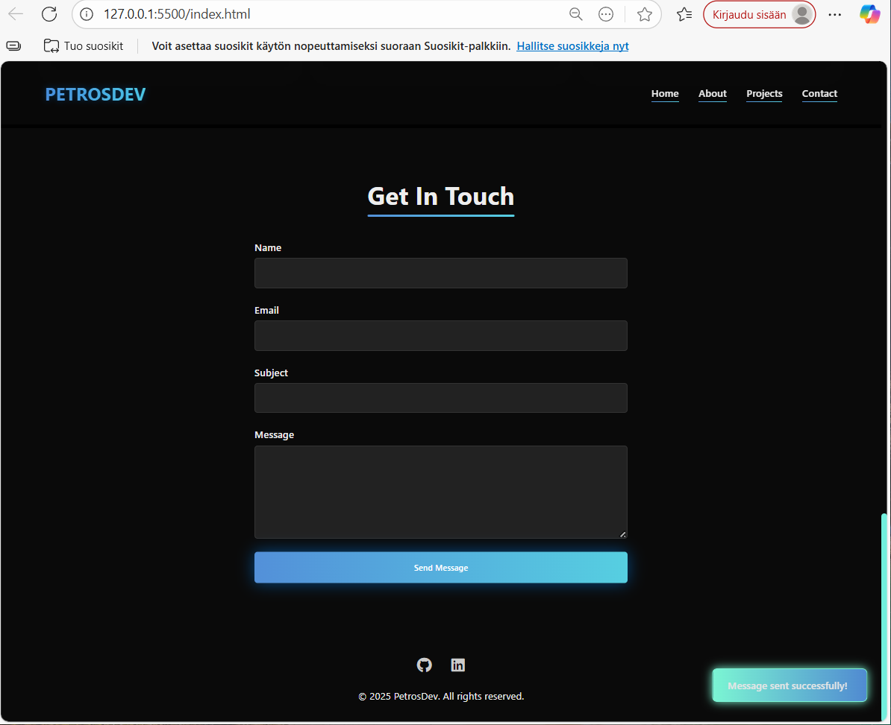

# Portfolio – Petros

A personal developer portfolio built with HTML, CSS, and vanilla JavaScript. It showcases skills, projects, and a contact form using SendGrid for email handling.

## Screenshots

### Home

### About Me

### My Projects

### Contact Section

### Successful Message Submission

### Responsive Design

### Portfolio – Petros

A personal developer portfolio built with HTML, CSS, and vanilla JavaScript. It features smooth animations, responsive design, and a working contact form (SendGrid-based on the backend).

## Features

Animated skill bars

Smooth scroll navigation

Responsive layout for all screen sizes

Contact form connected to a backend email service (SendGrid)

Toast notifications for feedback

### Contact Form

The contact form is connected to a backend service using SendGrid to handle email submissions.
## Note: For security reasons, the API key is not included in this repository. You’ll need to set up your own backend and API key if you wish to make the form functional.

### How to Use

Clone the repository:

git clone https://github.com/YourUsername/portfolio-petros.git

Open the project in your editor.

Launch index.html in a browser to preview.