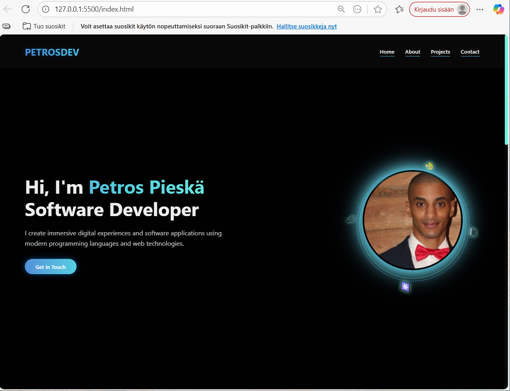
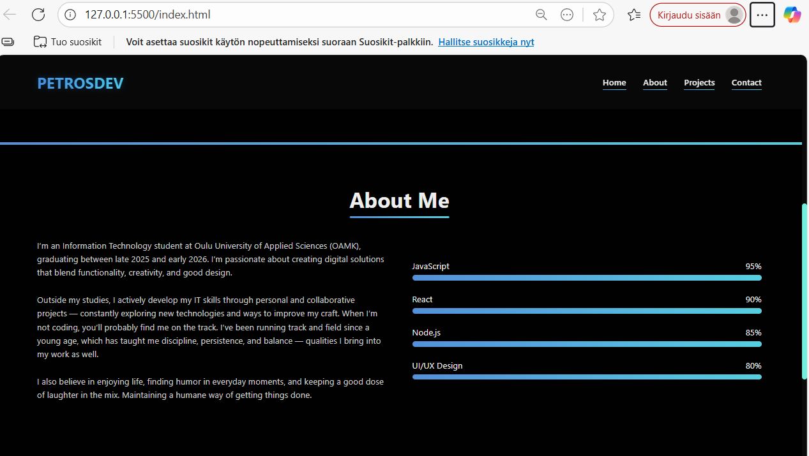
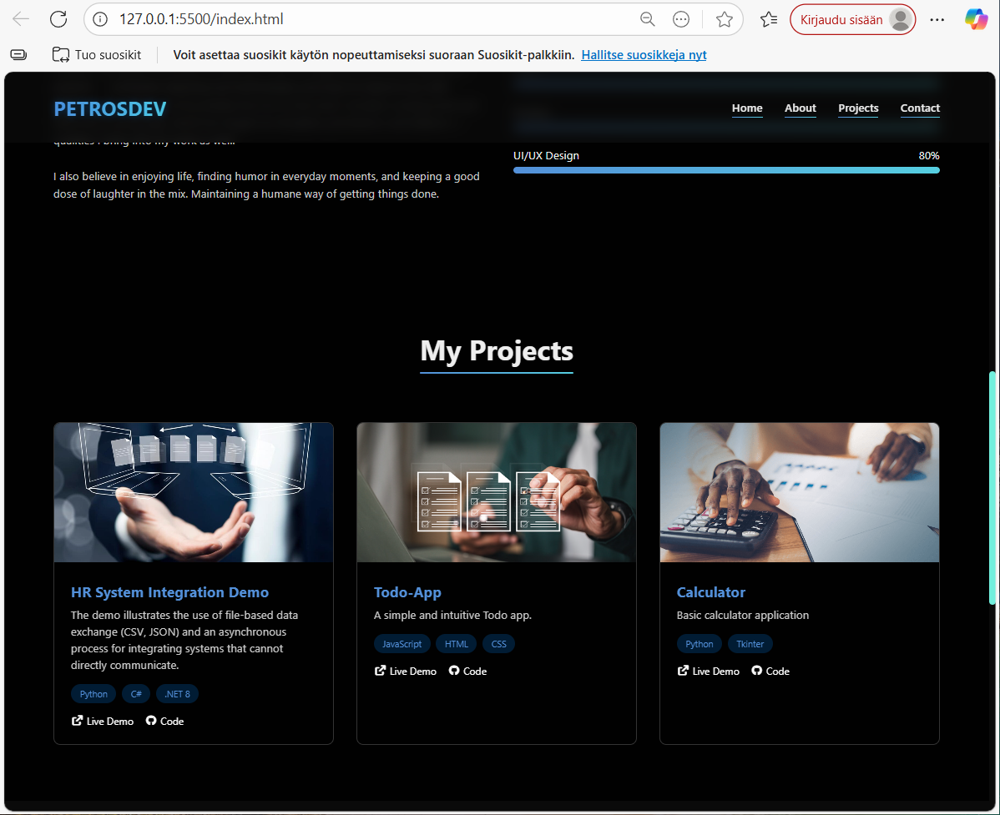

# Portfolio – Petros
My personal portfolio to showcase my work and myself.

## Screenshots

### Home

### About Me

### My Projects

### Responsive Design

### Portfolio – Petros

A personal developer portfolio built with HTML, CSS, and vanilla JavaScript. It features smooth animations, responsive design, and a working contact form (SendGrid-based on the backend. NOT WORKING ON GitHubPages).

## Features

Animated skill bars

Smooth scroll navigation

Responsive layout for all screen sizes

Toast notifications for feedback

### How to Use
visit:
https://petrospieska.github.io/portfolio-petros/
